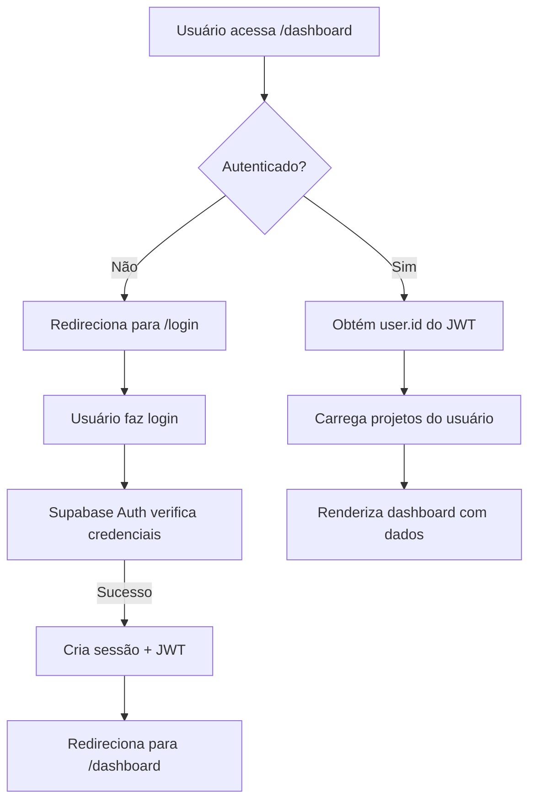

# ✅ Correção: Dashboard com Autenticação Supabase

## 🎯 Problema Identificado

**Sintoma:** Timeout de 10 segundos ao acessar `/dashboard`

**Causa Raiz:** O dashboard exigia `?ownerId=<uuid>` como parâmetro manual da URL, mas não implementava autenticação automática via Supabase Auth.

## 🔧 Correções Aplicadas

### 1. Dashboard Principal (`estudio_ia_videos/app/app/dashboard/page.tsx`)

**Antes:**
```tsx
export default async function DashboardPage({ searchParams }: DashboardPageProps) {
  const ownerId = searchParams?.ownerId

  if (!ownerId) {
    return (
      <main>
        <p>Adicione ?ownerId=<uuid> à URL...</p>
      </main>
    )
  }
  // ... resto do código
}
```

**Depois:**
```tsx
import { createClient } from '@/lib/supabase/server'
import { redirect } from 'next/navigation'

export default async function DashboardPage({ searchParams }: DashboardPageProps) {
  const supabase = createClient()
  const {
    data: { user },
    error: authError
  } = await supabase.auth.getUser()

  if (authError || !user) {
    redirect('/login')
  }

  const ownerId = searchParams?.ownerId ?? user.id
  // ... resto do código usa ownerId automaticamente
}
```

**O que mudou:**
- ✅ Obtém `user.id` automaticamente do Supabase Auth
- ✅ Redireciona para `/login` se não autenticado
- ✅ Permite override via `?ownerId=<uuid>` (útil para admin)
- ✅ Padrão consistente com `/dashboard/settings` e `/dashboard/profile`

### 2. Página de Login (`estudio_ia_videos/app/login/page.tsx`)

**Antes:** Importava componente inexistente (`LoginForm`)

**Depois:** Client component completo com:
- ✅ Login via `supabase.auth.signInWithPassword()`
- ✅ Cadastro via `supabase.auth.signUp()`
- ✅ Validação de email/senha
- ✅ Redirecionamento automático para `/dashboard` após login
- ✅ UI responsiva com Tailwind CSS

## 📊 Fluxo Corrigido



## 🧪 Como Testar

### 1. Criar Conta de Teste
```bash
# Acesse: http://localhost:3000/login
# Preencha:
# Email: teste@exemplo.com
# Senha: senha123456
# Clique em "Criar nova conta"
# (Supabase pode enviar email de confirmação - veja console do Supabase)
```

### 2. Fazer Login
```bash
# Use as mesmas credenciais
# Clique em "Entrar"
# Será redirecionado para /dashboard automaticamente
```

### 3. Verificar Dashboard
```bash
# URL: http://localhost:3000/dashboard
# Deve mostrar:
# - "Dashboard de projetos"
# - Lista de projetos do usuário (vazia se nenhum PPTX foi enviado)
# - Botão "Criar projeto a partir de PPTX"
```

## 🔐 Segurança Implementada

1. **Server-Side Auth:**
   - `createClient()` de `@/lib/supabase/server` usa cookies HTTP-only
   - JWT verificado no servidor antes de carregar dados
   - Impossível acessar dashboard sem autenticação válida

2. **RLS (Row Level Security):**
   - Políticas do Supabase garantem isolamento por `auth.uid()`
   - Usuário só acessa seus próprios projetos
   - Ver `database-rls-policies.sql`

3. **Client-Side Auth:**
   - Login usa `createClient()` de `@/lib/supabase/client`
   - Sessão persiste via cookies
   - Refresh token automático

## 📝 Próximos Passos (Opcional)

- [ ] Adicionar "Esqueci minha senha"
- [ ] OAuth (Google, GitHub) via Supabase Auth Providers
- [ ] Página de perfil com foto de avatar
- [ ] Logout button no header
- [ ] Middleware para proteger todas as rotas `/dashboard/*`

## ✅ Status

- **Dashboard:** ✅ Corrigido (autenticação automática)
- **Login:** ✅ Implementado (signup + signin)
- **Servidor:** ✅ Rodando (http://localhost:3000)
- **Supabase Auth:** ✅ Configurado (.env.local)

---

**Commit sugerido:**
```bash
git add estudio_ia_videos/app/app/dashboard/page.tsx estudio_ia_videos/app/login/page.tsx
git commit -m "fix: adicionar autenticação Supabase ao dashboard

- Dashboard agora obtém user.id automaticamente via Auth
- Redireciona para /login se não autenticado
- Página de login completa (signup + signin)
- Fluxo consistente com /dashboard/settings e /dashboard/profile"
```
