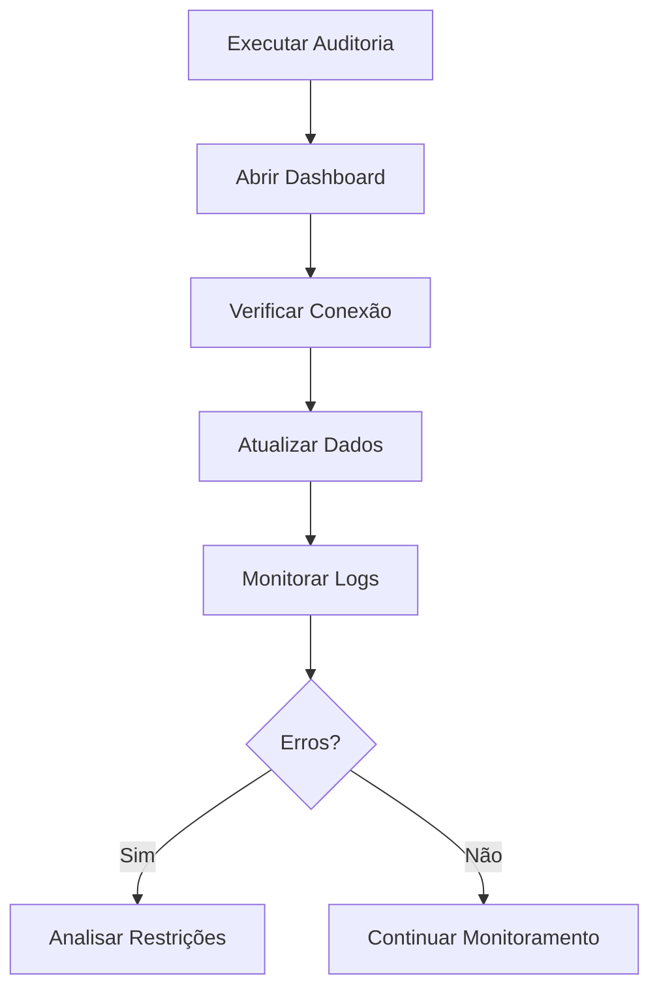

# 🎬 Dashboard Supabase - Avatar 3D Studio

## 📋 Visão Geral

Dashboard web interativo para monitoramento em tempo real do sistema Avatar 3D Studio integrado ao Supabase. Fornece visualização completa de avatares, vozes, estatísticas do sistema e restrições de acesso.

---

## ✨ Funcionalidades

### 1. **Monitoramento de Recursos**
- 🎥 **Avatares Disponíveis**: Lista todos os modelos de avatar cadastrados
- 🎙️ **Perfis de Voz**: Exibe configurações de voz por idioma e gênero
- ⚡ **Jobs de Render**: Status dos trabalhos de renderização
- 📊 **Analytics**: Métricas de uso e performance

### 2. **Estatísticas do Sistema**
- 💻 CPU Usage
- 🎮 GPU Usage
- ✅ Taxa de Sucesso
- 📊 Total de Renders

### 3. **Auditoria Integrada**
- 🕒 Timestamp da última auditoria
- 🔓/🔐 Modo de acesso (Anônimo ou Service Key)
- 🛡️ Restrições detectadas em tabelas

### 4. **Logs de Atividade**
- 📝 Registro em tempo real de todas as operações
- ✅ Mensagens de sucesso
- ❌ Alertas de erro
- ℹ️ Informações do sistema

---

## 🚀 Como Usar

### **Passo 1: Abrir o Dashboard**

```bash
# Opção 1: Navegador direto (recomendado)
start chrome "C:\xampp\htdocs\_MVP_Video_TecnicoCursos_v7\dashboard-supabase.html"

# Opção 2: Firefox
start firefox "C:\xampp\htdocs\_MVP_Video_TecnicoCursos_v7\dashboard-supabase.html"

# Opção 3: Servidor web (XAMPP/Apache)
# Acesse: http://localhost/_MVP_Video_TecnicoCursos_v7/dashboard-supabase.html
```

### **Passo 2: Executar Auditoria Antes**

Para que o dashboard mostre informações completas sobre restrições, execute a auditoria primeiro:

```powershell
# PowerShell
.\migrate-to-supabase.ps1 -ReportPath "supabase-audit.json"
```

Isso gera o arquivo `supabase-audit.json` que o dashboard lerá automaticamente.

### **Passo 3: Interagir com os Botões**

- **🔄 Atualizar Dados**: Recarrega avatares, vozes, e estatísticas do Supabase
- **🔗 Testar Conexão**: Valida conectividade com a API REST do Supabase
- **📋 Recarregar Auditoria**: Re-lê o arquivo `supabase-audit.json`

---

## 🔧 Configuração

### **Credenciais Supabase**

O dashboard já vem pré-configurado com as credenciais do projeto:

```javascript
const SUPABASE_URL = 'https://ofhzrdiadxigrvmrhaiz.supabase.co';
const SUPABASE_KEY = 'eyJhbGc...'; // Chave anônima
```

Se você precisar alterar as credenciais:

1. Abra `dashboard-supabase.html` em um editor de texto
2. Localize a seção `<script>` (linha ~370)
3. Substitua `SUPABASE_URL` e `SUPABASE_KEY` pelos novos valores

### **Auto-Refresh**

O dashboard atualiza automaticamente a cada **5 minutos**. Para alterar:

```javascript
// Linha ~650
setInterval(loadAllData, 300000); // 300000 ms = 5 minutos

// Exemplo: atualizar a cada 2 minutos
setInterval(loadAllData, 120000);
```

---

## 📊 Estrutura de Dados

### **Avatares (`avatar_models`)**
```json
{
  "id": "uuid",
  "display_name": "Marcus - Executivo",
  "gender": "male",
  "avatar_type": "professional",
  "is_active": true
}
```

### **Vozes (`voice_profiles`)**
```json
{
  "id": "uuid",
  "display_name": "Voz Masculina Profissional BR",
  "language": "pt-BR",
  "gender": "male",
  "is_active": true
}
```

### **Estatísticas do Sistema (`system_stats`)**
```json
{
  "cpu_usage": 45.5,
  "gpu_usage": 78.2,
  "success_rate": 0.95,
  "total_renders": 1234,
  "recorded_at": "2025-10-08T14:30:00Z"
}
```

### **Auditoria (`supabase-audit.json`)**
```json
{
  "timestamp": "2025-10-08T14:27:04.7105598-03:00",
  "mode": "anon",
  "connection_ok": true,
  "resources": {
    "avatars": [...],
    "voices": [...]
  },
  "operations": {
    "avatar_analytics": {
      "status": "restricted",
      "message": "Response status code does not indicate success: 404"
    }
  }
}
```

---

## 🛡️ Permissões e Segurança

### **Modo Anônimo (Atual)**
- ✅ Leitura de `avatar_models`
- ✅ Leitura de `voice_profiles`
- ❌ Escrita bloqueada por RLS
- ❌ Tabelas restritas: `render_jobs`, `avatar_analytics`, `system_stats`

### **Modo Service Key (Opcional)**
Para habilitar acesso total, adicione a Service Role Key:

```javascript
// Substitua SUPABASE_KEY pela Service Role Key
const SUPABASE_KEY = 'eyJhbGc... (service_role key)';
```

⚠️ **ATENÇÃO**: A Service Role Key tem acesso completo. Use apenas em ambientes seguros!

---

## 🎨 Personalização

### **Cores e Temas**

Edite as classes CSS no `<style>` (linhas 7-300):

```css
/* Gradiente de fundo */
body {
    background: linear-gradient(135deg, #667eea 0%, #764ba2 100%);
}

/* Cor principal dos botões */
.refresh-btn {
    background: linear-gradient(45deg, #3498db, #2980b9);
}
```

### **Ícones dos Cards**

```html
<!-- Avatar card -->
<div class="stat-icon" style="background: #3498db;">🎥</div>

<!-- Alterar ícone e cor -->
<div class="stat-icon" style="background: #e74c3c;">🤖</div>
```

---

## 🔍 Solução de Problemas

### **Problema: "Arquivo de auditoria não encontrado"**

**Solução**: Execute a auditoria primeiro:
```powershell
.\migrate-to-supabase.ps1 -ReportPath "supabase-audit.json"
```

### **Problema: "Não foi possível carregar os avatares"**

**Possíveis causas**:
1. Conexão de rede perdida
2. Chave do Supabase inválida
3. RLS bloqueando leitura

**Solução**:
1. Clique em **🔗 Testar Conexão**
2. Verifique as credenciais no código
3. Revise as políticas RLS no Supabase Dashboard

### **Problema: "System Stats indisponíveis"**

**Causa**: Tabela `system_stats` vazia ou restrita.

**Solução**: 
- Se você tiver Service Role Key, habilite-a no código
- Ou: aguarde que jobs de render populem a tabela

### **Problema: Dashboard não atualiza**

**Solução**:
1. Abra o Console do Navegador (F12)
2. Verifique erros na aba **Console**
3. Analise chamadas de rede na aba **Network**
4. Forçe atualização: `Ctrl + Shift + R`

---

## 📈 Métricas de Performance

### **Tempo de Carregamento**
- Inicial: ~2-3 segundos
- Refresh: ~1-2 segundos
- Auditoria JSON: <100ms

### **Requisições por Atualização**
1. `avatar_models` → 1 requisição
2. `voice_profiles` → 1 requisição
3. `system_stats` → 1 requisição
4. `render_jobs` → 1 requisição
5. `avatar_analytics` → 1 requisição
6. `supabase-audit.json` → 1 requisição (local)

**Total**: 6 requisições

---

## 🔄 Workflow Recomendado

### **Uso Diário**



### **Fluxo de Dados**

```
PowerShell Script (migrate-to-supabase.ps1)
        ↓
  supabase-audit.json
        ↓
  Dashboard HTML (leitura)
        ↓
  Supabase REST API (consultas)
        ↓
  Visualização em Tempo Real
```

---

## 🆘 Suporte

### **Logs do Navegador**

Para depuração avançada:

```javascript
// Abra Console (F12) e digite:
console.log('Avatares:', await apiRequest('avatar_models'));
console.log('Vozes:', await apiRequest('voice_profiles'));
```

### **Comandos de Teste**

```powershell
# Testar conectividade
curl "https://ofhzrdiadxigrvmrhaiz.supabase.co/rest/v1/" `
  -H "apikey: YOUR_KEY" `
  -H "Authorization: Bearer YOUR_KEY"

# Listar avatares
curl "https://ofhzrdiadxigrvmrhaiz.supabase.co/rest/v1/avatar_models" `
  -H "apikey: YOUR_KEY" `
  -H "Authorization: Bearer YOUR_KEY"
```

---

## 📝 Changelog

### **v2.0 - 08/10/2025**
- ✅ Integração com `supabase-audit.json`
- ✅ Card de "Última Auditoria"
- ✅ Seção "Restrições Detectadas"
- ✅ Melhor tratamento de erros
- ✅ Botão "Recarregar Auditoria"
- ✅ Mensagens informativas para tabelas vazias

### **v1.0 - 07/10/2025**
- ✅ Dashboard inicial
- ✅ Listagem de avatares e vozes
- ✅ Verificação de conexão
- ✅ Logs de atividade
- ✅ Auto-refresh a cada 5 minutos

---

## 📚 Referências

- [Supabase REST API Docs](https://supabase.com/docs/guides/api)
- [PostgREST Documentation](https://postgrest.org/en/stable/)
- [Row Level Security (RLS)](https://supabase.com/docs/guides/auth/row-level-security)

---

**Desenvolvido para**: Avatar 3D Studio - Projeto NR-35 Segurança do Trabalho  
**Data**: Outubro 2025  
**Status**: ✅ Operacional (Modo Anônimo)
