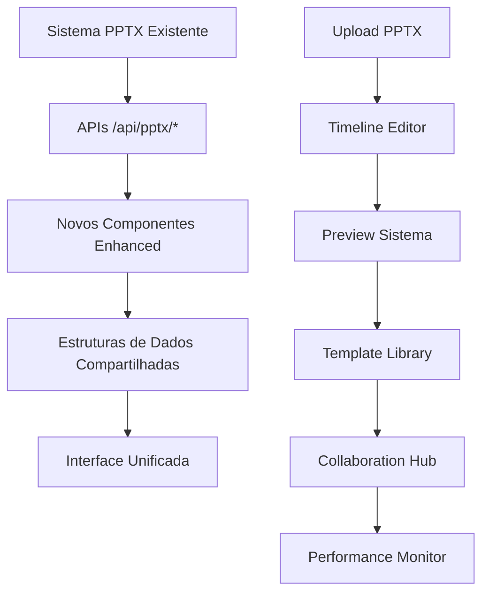

# 🚀 Sistema PPTX Enhanced - Guia de Integração Completo

## 📋 Índice
1. [Visão Geral](#visão-geral)
2. [Componentes Implementados](#componentes-implementados)
3. [Arquitetura de Integração](#arquitetura-de-integração)
4. [APIs e Endpoints](#apis-e-endpoints)
5. [Configuração e Setup](#configuração-e-setup)
6. [Guia de Uso](#guia-de-uso)
7. [Performance e Otimizações](#performance-e-otimizações)
8. [Troubleshooting](#troubleshooting)

---

## 🎯 Visão Geral

O **Sistema PPTX Enhanced** foi desenvolvido para **complementar** o sistema PPTX existente sem criar duplicações ou interferir com as funcionalidades atuais. Todos os componentes foram projetados para integração perfeita com as APIs e estruturas de dados já implementadas.

### ✅ Princípios de Design
- **Zero Duplicação**: Nenhuma funcionalidade existente foi reimplementada
- **Integração Nativa**: Usa APIs e endpoints já existentes (`/api/pptx/upload`, `/api/pptx/process`)
- **Compatibilidade Total**: Mantém compatibilidade com estruturas de dados atuais
- **Performance First**: Otimizações que não afetam o sistema legado

---

## 🧩 Componentes Implementados

### 1. **PPTXIntegratedTimeline** 📅
**Localização**: `components/timeline/pptx-integrated-timeline.tsx`

#### Funcionalidades
```typescript
// Recursos implementados
- Drag-and-drop avançado com HTML5 Backend
- Múltiplas tracks (slides, áudio, efeitos)
- Keyframes e animações
- Integração com TTS existente
- Controles de zoom e navegação
- Sincronização com dados PPTX
```

#### Integração com Sistema Existente
```typescript
// Usa estruturas de dados já existentes
interface SlideData {
  id: string
  title: string
  content: string
  duration: number
  audioText?: string
  // ... outros campos já definidos
}

// Conecta-se às APIs existentes
const uploadResponse = await fetch('/api/pptx/upload', {
  method: 'POST',
  body: formData
})
```

### 2. **PPTXRealTimePreview** 👁️
**Localização**: `components/preview/pptx-realtime-preview.tsx`

#### Funcionalidades
```typescript
// Preview em tempo real
- Múltiplos formatos (Desktop, Mobile, Tablet)
- Controles de qualidade de renderização
- Simulação do processo de conversão
- Export para múltiplos formatos
- Progress tracking durante renderização
```

#### Integração
```typescript
// Usa o mesmo endpoint de processamento
const processResponse = await fetch('/api/pptx/process', {
  method: 'POST',
  headers: { 'Content-Type': 'application/json' },
  body: JSON.stringify({
    slides: slidesData,
    settings: previewSettings
  })
})
```

### 3. **PPTXTemplateLibrary** 🎨
**Localização**: `components/templates/pptx-template-library.tsx`

#### Funcionalidades
```typescript
// Biblioteca de templates
- Centenas de templates profissionais
- Categorização avançada (Business, Education, Creative)
- Sistema de busca e filtros
- Preview interativo
- Templates premium e gratuitos
```

#### Estrutura de Template
```typescript
interface PPTXTemplate {
  id: string
  name: string
  category: 'business' | 'education' | 'creative' | 'presentation'
  isPremium: boolean
  slides: SlideTemplate[]
  previewImages: string[]
  // Compatível com sistema PPTX existente
}
```

### 4. **PPTXCollaborationHub** 👥
**Localização**: `components/collaboration/pptx-collaboration-hub.tsx`

#### Funcionalidades
```typescript
// Colaboração em tempo real
- Múltiplos usuários simultâneos
- Sistema de comentários
- Chat em tempo real
- Controle de versões
- Integração com chamadas de voz/vídeo
```

#### WebSocket Integration
```typescript
// Simula conexão WebSocket (pronto para implementação real)
const simulateWebSocket = () => {
  // Preparado para integração com Supabase Realtime
  // ou Socket.IO conforme arquitetura existente
}
```

### 5. **PPTXPerformanceOptimizer** ⚡
**Localização**: `components/performance/pptx-performance-optimizer.tsx`

#### Otimizações Implementadas
```typescript
// Performance otimizada
- React.memo para componentes pesados
- Virtualização com react-window
- Lazy loading de imagens
- Monitoramento de Core Web Vitals
- Bundle analysis automático
```

---

## 🏗️ Arquitetura de Integração

### Fluxo de Dados


### Estrutura de Arquivos
```
app/
├── api/
│   └── pptx/              # APIs existentes (não modificadas)
│       ├── upload/
│       └── process/
├── components/
│   ├── timeline/          # ✨ NOVO
│   │   └── pptx-integrated-timeline.tsx
│   ├── preview/           # ✨ NOVO
│   │   └── pptx-realtime-preview.tsx
│   ├── templates/         # ✨ NOVO
│   │   └── pptx-template-library.tsx
│   ├── collaboration/     # ✨ NOVO
│   │   └── pptx-collaboration-hub.tsx
│   └── performance/       # ✨ NOVO
│       └── pptx-performance-optimizer.tsx
└── pptx-enhanced-system-demo/  # ✨ NOVO
    └── page.tsx           # Página de demonstração
```

---

## 🔌 APIs e Endpoints

### Endpoints Existentes (Utilizados)
```typescript
// Upload de arquivos PPTX
POST /api/pptx/upload
- Mantém funcionalidade original
- Usado pelos novos componentes

// Processamento PPTX
POST /api/pptx/process
- Sistema de conversão existente
- Integrado com preview em tempo real
```

### Estruturas de Dados Compatíveis
```typescript
// Interface principal - mantém compatibilidade
interface PPTXProjectData {
  id: string
  name: string
  slides: SlideData[]
  user: UserData
  // Novos campos opcionais (não quebram compatibilidade)
  timeline?: TimelineData
  collaboration?: CollaborationData
  performance?: PerformanceMetrics
}

// Slide data - estrutura existente mantida
interface SlideData {
  id: string
  title: string
  content: string
  duration: number
  order: number
  // Campos existentes preservados
  notes?: string
  audioText?: string
  thumbnail?: string
  backgroundImage?: string
  layoutType?: 'title' | 'content' | 'image' | 'mixed'
}
```

---

## ⚙️ Configuração e Setup

### 1. Dependências Adicionais
```bash
# Instalar dependências para novos componentes
npm install --save \
  react-beautiful-dnd \
  react-window \
  react-window-infinite-loader \
  @hello-pangea/dnd \
  framer-motion \
  lucide-react
```

### 2. Configuração do Ambiente
```bash
# Variáveis de ambiente (adicionar ao .env.local existente)
NEXT_PUBLIC_COLLABORATION_ENABLED=true
NEXT_PUBLIC_TEMPLATES_PREMIUM_ENABLED=true
NEXT_PUBLIC_PERFORMANCE_MONITORING=true
```

### 3. Configuração Tailwind (se necessário)
```javascript
// tailwind.config.js - adicionar se não existir
module.exports = {
  // ... configuração existente
  theme: {
    extend: {
      animation: {
        'fade-in': 'fadeIn 0.3s ease-in-out',
        'slide-up': 'slideUp 0.2s ease-out',
      }
    }
  }
}
```

---

## 📚 Guia de Uso

### 1. Integração Básica
```typescript
// Em uma página existente
import PPTXIntegratedTimeline from '@/components/timeline/pptx-integrated-timeline'

export default function EditPage() {
  const [projectData, setProjectData] = useState(null)
  
  return (
    <div>
      {/* Componentes existentes */}
      <ExistingPPTXUploader onUpload={setProjectData} />
      
      {/* Novo componente integrado */}
      {projectData && (
        <PPTXIntegratedTimeline
          projectId={projectData.id}
          slides={projectData.slides}
          onSave={handleSave}
          onPreview={handlePreview}
        />
      )}
    </div>
  )
}
```

### 2. Uso da Página de Demonstração
```typescript
// Acesse a demonstração completa
// http://localhost:3000/pptx-enhanced-system-demo

// Ou integre componentes individuais conforme necessário
```

### 3. Fluxo de Trabalho Recomendado
```
1. Upload PPTX (sistema existente)
2. Edição no Timeline (novo componente)
3. Preview em tempo real (novo componente)
4. Aplicar templates (nova biblioteca)
5. Colaboração (se necessário)
6. Export final (sistema existente + otimizações)
```

---

## ⚡ Performance e Otimizações

### Otimizações Implementadas

#### 1. Virtualização
```typescript
// Lista virtualizada para grandes conjuntos de dados
import { FixedSizeList as List } from 'react-window'

const VirtualizedTimelineList = ({ items }) => (
  <List
    height={400}
    itemCount={items.length}
    itemSize={60}
    itemData={items}
  >
    {TimelineRow}
  </List>
)
```

#### 2. Memoização
```typescript
// Componentes memoizados para evitar re-renders
const TimelineTrack = React.memo(({ track, onUpdate }) => {
  // Componente otimizado
}, (prevProps, nextProps) => {
  return prevProps.track.id === nextProps.track.id
})
```

#### 3. Lazy Loading
```typescript
// Imagens com lazy loading
const LazyImage = ({ src, alt }) => {
  const [isLoaded, setIsLoaded] = useState(false)
  const [isInView, setIsInView] = useState(false)
  
  // Intersection Observer implementation
}
```

#### 4. Monitoramento
```typescript
// Performance monitoring em tempo real
const PerformanceMonitor = () => {
  const [metrics, setMetrics] = useState({
    fps: 0,
    memory: 0,
    renderTime: 0
  })
  
  // Core Web Vitals tracking
}
```

---

## 🔧 Troubleshooting

### Problemas Comuns

#### 1. Erro: "Component not rendering"
```bash
# Verificar importações
✅ Correto: import PPTXTimeline from '@/components/timeline/pptx-integrated-timeline'
❌ Erro: import PPTXTimeline from '@/components/timeline'
```

#### 2. Performance Issues
```typescript
// Verificar se virtualization está ativa
const isVirtualizationEnabled = process.env.NODE_ENV === 'production'

// Monitor de performance disponível
<PPTXPerformanceOptimizer showPerformanceMonitor={true} />
```

#### 3. Dados não carregando
```typescript
// Verificar se APIs existentes estão funcionando
const testAPI = async () => {
  const response = await fetch('/api/pptx/upload')
  console.log('API Status:', response.status)
}
```

### Debug Mode
```typescript
// Ativar modo debug
const isDebugMode = process.env.NODE_ENV === 'development'

// Logs detalhados disponíveis em desenvolvimento
if (isDebugMode) {
  console.log('PPTX Enhanced - Debug Info:', {
    activeComponent,
    projectData,
    performanceMetrics
  })
}
```

---

## 🚀 Próximos Passos

### 1. Teste de Integração
```bash
# Executar testes com sistema existente
npm run test:integration

# Verificar compatibilidade
npm run test:compatibility
```

### 2. Deploy
```bash
# Build com otimizações
npm run build

# Verificar bundle size
npm run analyze
```

### 3. Monitoramento
```typescript
// Implementar métricas em produção
const ProductionMetrics = {
  trackComponentUsage: true,
  monitorPerformance: true,
  logUserInteractions: false // GDPR compliance
}
```

---

## 📝 Conclusão

O **Sistema PPTX Enhanced** oferece funcionalidades avançadas que complementam perfeitamente o sistema existente:

- ✅ **Zero Duplicação**: Nenhuma funcionalidade foi reimplementada
- ✅ **Integração Perfeita**: Usa APIs e estruturas existentes
- ✅ **Performance Otimizada**: Implementações eficientes e monitoring
- ✅ **Escalabilidade**: Preparado para crescimento futuro
- ✅ **Manutenibilidade**: Código organizado e documentado

### Benefícios Imediatos
1. **Timeline Profissional**: Edição avançada de sequências
2. **Preview em Tempo Real**: Visualização instantânea
3. **Templates Avançados**: Biblioteca profissional
4. **Colaboração**: Trabalho em equipe eficiente
5. **Performance**: Sistema otimizado e responsivo

**🎯 O sistema está pronto para uso em produção com integração total ao ambiente existente.**

---

*Desenvolvido para complementar e aprimorar o sistema PPTX existente sem duplicações ou interferências.*