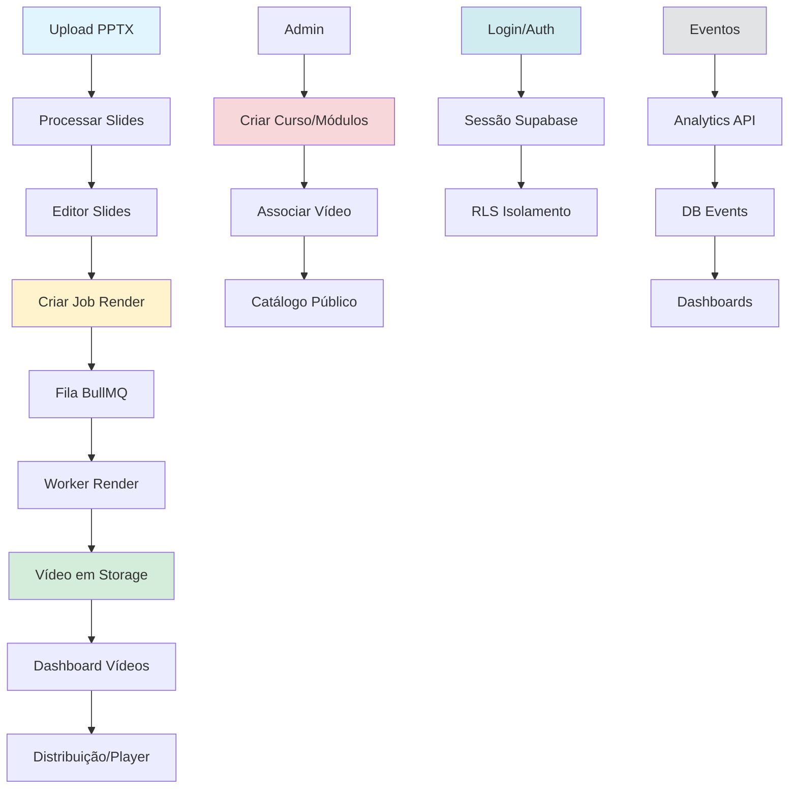

# Inventário de Fluxos Core – MVP Vídeo TécnicoCursos v7

**Data de Criação:** 13/11/2025  
**Responsável:** Ana S. (Sponsor) + Felipe T. (Front)  
**Status:** ⏳ Em andamento  
**Objetivo:** Mapear os fluxos críticos do sistema, identificando owners, integrações, dependências e pontos de controle.

---

## 1. Fluxo de Criação de Vídeo (Upload PPTX → Processamento)

### 1.1. Descrição
Permite ao usuário fazer upload de apresentações PPTX, extrair slides e metadados, normalizar a estrutura para alimentar o editor de vídeos.

### 1.2. Jornada do Usuário
1. Usuário acessa página `/dashboard/novo-video`
2. Faz upload de arquivo PPTX via formulário
3. Sistema valida formato, tamanho (<100MB) e estrutura
4. Backend processa o arquivo com `processPPTXFile`:
   - Extrai slides via JSZip
   - Normaliza metadata (title, author, slideCount)
   - Gera thumbnails (quando disponível)
5. Estado armazenado em Zustand (`slidesStore`)
6. Usuário visualiza slides extraídos no editor

### 1.3. Componentes Técnicos
| Componente | Localização | Owner | Observações |
|------------|-------------|-------|-------------|
| UI Upload | `app/(routes)/dashboard/novo-video` | Felipe T. | Formulário com drag-drop, validação client |
| PPTX Parser | `estudio_ia_videos/app/lib/pptx-processor.ts` | Bruno L. | JSZip + fast-xml-parser |
| Validação | `estudio_ia_videos/app/lib/pptx-validation.ts` | Bruno L. | Verifica estrutura mínima |
| Estado Slides | `estudio_ia_videos/app/store/slides-store.ts` | Felipe T. | Zustand (slides, order_index, metadata) |
| Testes | `estudio_ia_videos/app/tests/pptx-*.test.ts` | Carla M. | Unit + system tests |

### 1.4. Integrações
- **Storage (futuro):** Supabase bucket `assets` para armazenar PPTX original
- **DB (futuro):** Tabela `slides` para persistir resultado processado

### 1.5. Dependências Críticas
- JSZip: parsing de arquivo ZIP
- fast-xml-parser: leitura de XML do PPTX
- Zustand: estado front-end

### 1.6. Métricas de Sucesso
- Tempo médio de processamento: < 5s para PPTX com 50 slides
- Taxa de erro: < 2% (arquivos corrompidos/formato inválido)

### 1.7. Pontos de Falha Conhecidos
- Arquivos >100MB: validação reject, mas pode travar browser
- PPTX com fontes/imagens embedded: possível OOM em parser
- **Mitigação:** Implementar streaming, limites mais agressivos

---

## 2. Fluxo de Renderização de Vídeo (Composição → Export)

### 2.1. Descrição
Transforma slides normalizados em composição Remotion, enfileira job de render via BullMQ, executa FFmpeg e armazena vídeo final.

### 2.2. Jornada do Usuário
1. Usuário finaliza edição de slides no editor
2. Clica em "Gerar Vídeo"
3. Sistema valida slides obrigatórios, cria job de render
4. Job enfileirado em Redis/BullMQ (`render-queue`)
5. Worker `render-worker.ts` processa:
   - Monta composição Remotion com cenas
   - Renderiza via `@remotion/renderer`
   - FFmpeg une áudio/vídeo (se TTS disponível)
6. Vídeo salvo em bucket `videos`
7. Job atualizado: `status='completed'`, `progress=100`
8. Usuário notificado, acessa vídeo pronto

### 2.3. Componentes Técnicos
| Componente | Localização | Owner | Observações |
|------------|-------------|-------|-------------|
| Editor UI | `app/(routes)/dashboard/editor` | Felipe T. | Reordenação @dnd-kit, preview |
| API Create Job | `app/api/v1/video-jobs/route.ts` | Bruno L. | POST: cria `render_jobs` + enfileira |
| BullMQ Queue | `lib/queues/render-queue.ts` | Diego R. | Fila Redis, config retry |
| Render Worker | `workers/render-worker.ts` | Bruno L. | Processa jobs, executa Remotion+FFmpeg |
| Composição Remotion | `estudio_ia_videos/app/remotion/` | Felipe T. | Cenas, transições, metadata |
| Storage | Supabase bucket `videos` | Diego R. | Vídeo final MP4 |
| Testes Contrato | `scripts/test-contract-video-jobs*.js` | Carla M. | Validam API create/list/status/cancel |

### 2.4. Integrações
- **Supabase:** tabela `render_jobs` (status, progress, metadata)
- **Redis (Upstash):** fila BullMQ para jobs assíncronos
- **FFmpeg:** encoding final (requer binário instalado)
- **Remotion:** framework de composição (Node/React)
- **TTS (futuro):** gerar áudio narrado antes de render

### 2.5. Dependências Críticas
- Redis disponível: sem Redis, jobs não são enfileirados
- FFmpeg instalado: sem FFmpeg, render falha no encoding
- Worker rodando: precisa `node workers/render-worker.ts` ativo
- Recursos CPU/memória: render intensivo (4GB+ por job)

### 2.6. Métricas de Sucesso
- Tempo médio de render: < 10 min para vídeo de 5 min (50 slides)
- Taxa de sucesso: ≥ 95%
- MTTR fila parada: < 30 min (alerta + restart worker)

### 2.7. Pontos de Falha Conhecidos
- Worker manual: precisa iniciar manualmente, sem auto-restart
- Timeout FFmpeg: vídeos longos (>10 min) podem timeout
- Falta health-check: não sabemos se worker está vivo
- **Mitigação:** Implementar health-check, monitoramento BullMQ, retry policy

---

## 3. Fluxo de Distribuição de Vídeo (Publicação → Acesso)

### 3.1. Descrição
Após render completo, vídeo é disponibilizado para acesso via URL pública ou restrita, integrado ao contexto de curso/módulo.

### 3.2. Jornada do Usuário
1. Vídeo renderizado, status `completed`
2. Sistema gera URL pública/privada (bucket Supabase)
3. Usuário acessa dashboard `/dashboard/videos/[id]`
4. Visualiza player com vídeo, metadata (título, duração, thumbnail)
5. (Futuro) Vídeo associado a módulo em `nr_modules`, visível em catálogo público

### 3.3. Componentes Técnicos
| Componente | Localização | Owner | Observações |
|------------|-------------|-------|-------------|
| Dashboard Vídeos | `app/(routes)/dashboard/videos` | Felipe T. | Lista, detalhes, player |
| Player | `app/components/video/player.tsx` | Felipe T. | HTML5 video ou lib (video.js?) |
| API List/Get | `app/api/v1/video-jobs/*` | Bruno L. | Endpoints CRUD jobs |
| Storage Public URL | Supabase bucket `videos` | Diego R. | Gerar signed URL ou público |
| DB Relação | Tabelas `render_jobs`, `nr_modules` (futuro) | Diego R. | FK job → módulo |

### 3.4. Integrações
- **Supabase Storage:** URLs públicas ou signed (TTL)
- **DB:** `render_jobs.output_url` armazena link final
- **Analytics (futuro):** `analytics_events` registra views

### 3.5. Dependências Críticas
- Bucket `videos` criado e acessível
- Políticas RLS permitindo SELECT público (ou por usuário)

### 3.6. Métricas de Sucesso
- Taxa de reprodução: ≥ 90% dos vídeos completados são visualizados
- Tempo de carregamento player: < 3s

### 3.7. Pontos de Falha Conhecidos
- URLs públicas sem TTL: risco de acesso não autorizado
- Falta CDN: latência alta para usuários distantes
- **Mitigação:** Implementar signed URLs com TTL, avaliar CDN (Cloudflare/CloudFront)

---

## 4. Fluxo de Gestão de Cursos e Módulos (Nr Sistema)

### 4.1. Descrição
Permite administradores criarem cursos (`nr_courses`) e módulos (`nr_modules`), vinculando vídeos renderizados à estrutura de conteúdo público.

### 4.2. Jornada do Administrador
1. Acessa `/dashboard/admin/cursos` (futuro)
2. Cria novo curso (título, descrição, categoria)
3. Adiciona módulos ao curso (ordem, título, vídeo associado)
4. Publica curso (visível no catálogo público)
5. Usuários finais visualizam em `/cursos/[slug]`

### 4.3. Componentes Técnicos
| Componente | Localização | Owner | Observações |
|------------|-------------|-------|-------------|
| Admin UI Cursos | `app/(routes)/dashboard/admin/cursos` (a criar) | Felipe T. | CRUD cursos/módulos |
| API Cursos | `app/api/v1/courses/*` (a criar) | Bruno L. | Endpoints protegidos (admin only) |
| DB Schema | `database-schema.sql` (nr_courses, nr_modules) | Diego R. | RLS: SELECT público, MUTATE admin |
| Catálogo Público | `app/(routes)/cursos` (a criar) | Felipe T. | Lista cursos, detalhes módulos |

### 4.4. Integrações
- **Supabase:** tabelas `nr_courses`, `nr_modules`, RLS
- **Vídeos:** FK `nr_modules.video_id → render_jobs.id`
- **Analytics:** eventos `course_view`, `module_completed`

### 4.5. Dependências Críticas
- RLS configurado: políticas em `database-rls-policies.sql`
- Função `is_admin()`: verifica permissões do usuário logado

### 4.6. Métricas de Sucesso
- Tempo para criar curso completo: < 10 min (incluindo upload de vídeos)
- Taxa de publicação: ≥ 80% dos cursos criados são publicados

### 4.7. Pontos de Falha Conhecidos
- UI Admin não implementada: bloqueador para Fase 5
- RLS sem auditoria: possível escalação de privilégios
- **Mitigação:** Implementar Fase 5, auditar RLS com `scripts/rls-audit.ts`

---

## 5. Fluxo de Autenticação e Autorização

### 5.1. Descrição
Gerencia login, registro, sessões e controle de acesso baseado em papéis (futuro RBAC).

### 5.2. Jornada do Usuário
1. Usuário acessa `/login` ou `/register`
2. Autentica via Supabase Auth (email/senha, OAuth providers)
3. Sessão armazenada via cookies (`createServerClient`)
4. Acesso a rotas protegidas: middleware valida `auth.uid()`
5. (Futuro) Papéis (`admin`, `editor`, `viewer`) restringem funcionalidades

### 5.3. Componentes Técnicos
| Componente | Localização | Owner | Observações |
|------------|-------------|-------|-------------|
| Auth Pages | `app/(routes)/(auth)/login`, `/register` | Felipe T. | Formulários, OAuth buttons |
| Supabase Client | `lib/supabase/client.ts`, `server.ts` | Bruno L. | `createClient()` padrão |
| Middleware | `middleware.ts` (a criar/revisar) | Bruno L. | Valida sessão, redireciona |
| RLS Policies | `database-rls-policies.sql` | Diego R. | Isolamento por `auth.uid()` |
| API Auth | `app/api/auth/*` (callback, logout) | Bruno L. | Endpoints Supabase Auth |

### 5.4. Integrações
- **Supabase Auth:** gerencia usuários, sessões, tokens
- **RLS:** aplica isolamento automático nas queries
- **Cookies:** armazena sessão, HTTP-only, Secure

### 5.5. Dependências Críticas
- Env vars: `NEXT_PUBLIC_SUPABASE_URL`, `NEXT_PUBLIC_SUPABASE_ANON_KEY`
- RLS ativado: sem RLS, dados vazam entre usuários
- HTTPS em produção: cookies Secure requerem HTTPS

### 5.6. Métricas de Sucesso
- Taxa de conversão registro: ≥ 60% (dos que acessam `/register`)
- Tempo médio de login: < 3s

### 5.7. Pontos de Falha Conhecidos
- Middleware incompleto: algumas rotas podem não validar sessão
- Service role no front: risco de vazamento se usado incorretamente
- **Mitigação:** Auditar middleware, nunca expor `SERVICE_ROLE_KEY` no client

---

## 6. Fluxo de Analytics e Métricas

### 6.1. Descrição
Captura eventos de usuário e sistema, armazena em `analytics_events`, disponibiliza dashboards e relatórios.

### 6.2. Jornada de Dados
1. Evento disparado no front ou back (ex: `slide_reordered`, `video_viewed`)
2. Enviado para `app/api/v1/analytics/events` (POST)
3. Armazenado em `analytics_events` (user_id, event_type, event_data)
4. Agregações disponíveis em `/api/analytics/render-stats` (métricas de render)
5. Dashboards em `/dashboard/analytics` (futuro)

### 6.3. Componentes Técnicos
| Componente | Localização | Owner | Observações |
|------------|-------------|-------|-------------|
| Captura Front | `app/hooks/useAnalytics.ts` (a criar) | Felipe T. | Hook React para enviar eventos |
| API Events | `app/api/v1/analytics/events` | Bruno L. | POST: insere evento |
| API Stats | `app/api/v1/analytics/render-stats` | Bruno L. | GET: métricas agregadas render |
| Core Analytics | `app/lib/analytics/render-core.ts` | Bruno L. | Funções puras: métricas, percentis |
| DB | `analytics_events` | Diego R. | Particionado por timestamp (futuro) |
| Testes | `app/__tests__/lib/analytics/render-core.test.ts` | Carla M. | Unit tests métricas |

### 6.4. Integrações
- **Supabase:** `analytics_events`, `render_jobs`
- **Sentry (futuro):** correlacionar erros com eventos
- **Grafana (futuro):** dashboards visuais

### 6.5. Dependências Críticas
- Tabela `analytics_events` criada e indexada
- Políticas RLS: usuários veem só seus eventos (exceto admin)

### 6.6. Métricas de Sucesso
- Cobertura de eventos: ≥ 80% das ações críticas rastreadas
- Latência API events: < 200ms (p95)

### 6.7. Pontos de Falha Conhecidos
- Volume alto: `analytics_events` pode crescer rápido
- Falta rotação: logs antigos não são arquivados
- **Mitigação:** Implementar particionamento, rotação mensal, agregações pré-computadas

---

## Resumo de Integração entre Fluxos

---

## Próximos Passos

1. **Validar com stakeholders:** agendar reunião com Ana S., Bruno L., Felipe T. e Diego R. para revisar e ajustar mapeamento (até 15/01).
2. **Detalhar fluxos secundários:** onboarding, notificações, backups (adicionar seções conforme necessário).
3. **Atualizar com owners definitivos:** confirmar responsáveis por cada componente.
4. **Integrar com backlog:** vincular cards do `BACKLOG_MVP_INICIAL` aos fluxos correspondentes.
5. **Registrar em ADR:** decisões arquiteturais relevantes (ex: escolha Remotion, BullMQ) devem ter ADRs linkados.

---

**Registro de Mudanças:**
- 13/11/2025: Criação inicial do documento com 6 fluxos core mapeados.
